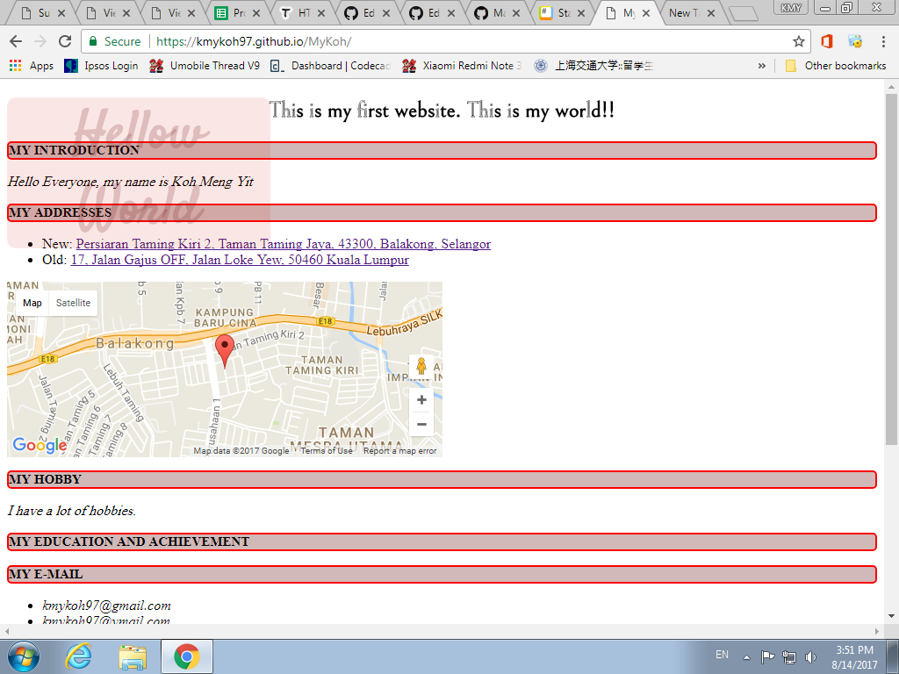

# Hello World, this is my [website](https://kmykoh97.github.io/MyKoh/)  

  

[Code](https://github.com/kmykoh97/MyKoh)  
[Other Works](https://github.com/kmykoh97)  

*All my codes are open source but please leave proper recognition*  
*Beginner, you can learn more about [programming](https://www.codecademy.com), [markdown language1](https://guides.github.com/features/mastering-markdown/) & [markdown language2](https://github.com/adam-p/markdown-here/wiki/Markdown-Cheatsheet#lines)*  

## Task List
- [x] Write basic html, css, Javascript roughwork
- [ ] Add Background
- [ ] Add Images
- [ ] Add videos
- [ ] Add animations
- [ ] Add alerts
- [ ] Add forms, objects...
- [ ] Add breathtaking designs
- [ ] Add fun
- [ ] Perfection!!

## Basic HTML/CSS/JS syntaxes:  
[**HTML**](https://tutorialehtml.com/en/html-tutorial-strikethrough/)  
* Add Images: ``
* Add Videos: 
```html
<video width="320" height="240" controls> OR <video width="320" height="240" autoplay>
<source src="" type="video/mp4">
Your browser does not support my video. Please use another browser!!
</video>
```
* Add bot/top pointers:
```html
<a href="#Top">Top</a>
&nbsp;|&nbsp;
<a href="#Bot">Bottom</a>
```
[**CSS**](https://www.w3schools.com/cssref/pr_background-repeat.asp)
* Add background image:
```CSS
body {
  background: url(".jpeg") no-repeat fixed center center;
}
```
* Format Images added in html:
```CSS
img.class {
  width: 350px;
  height: 450px;
  display: block;
  margin: 0px auto;
}
```

### Usage
Click anything you want freely.  
Feel free to review my code. I am open-minded. Submit your pull request and proper credit will be given.  

### Customizing
* Main Stylesheet(CSS)
* CSS inside html
* others: Javascript,...

### Layouts
If you'd like to change the HTML layout, there are few ways:
* Create a file called `/_layouts/default.html` in your project, write your codes in. **Do not create index.html file!**
* Create `index.html` in first page of repo and start coding.
* Don't create any `.html` file anywhere and write code in `readme.md`. Use markdown language to customise your webpage.
* Use git-provided alternative following 

### Contributor
* kmykoh97 (owner)
* ... (more to add)

### Project Philosophy
Everyone can create their own website. My code can be a guide for beginner.  
> There are three responses to a piece of design – yes, no, and WOW!
>  ~ Milton Glaser

### Contributing
Interested in telling me my mistake in code? Feel free to make commmit. I appreciate your time.  

### Finally...
If you like my work  
Bring me to your team so that we can take part in more projects together!!  

Thank you, sincerely,  
*kmykoh97* :blush:  

**Please contact me if you don't understand anything** :bowtie:
